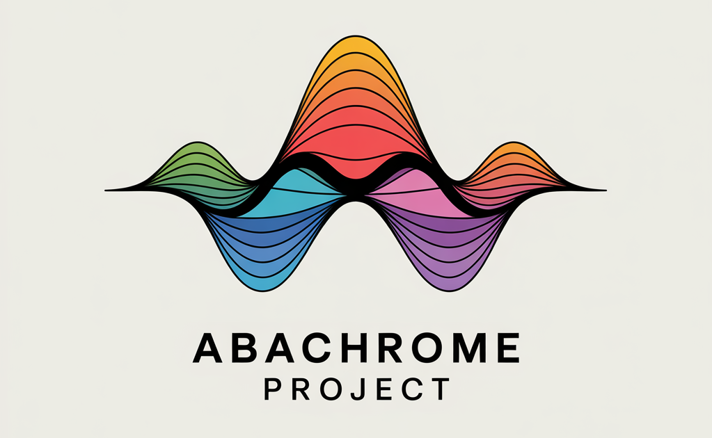

# Abachrome

[](https://opensource.org/licenses/MIT)
[](https://www.ruby-lang.org/en/)
[](https://badge.fury.io/rb/abachrome)
[](https://rubygems.org/gems/abachrome)
[](https://github.com/durableprogramming/abachrome)
[](http://makeapullrequest.com)
[](https://github.com/rubocop/rubocop)
[](https://github.com/tophat/getting-started/blob/master/scorecard.md)
[](https://durableprogramming.com)

Abachrome is a Ruby gem for parsing, manipulating, and managing colors. It provides a robust set of tools for working with various color formats including hex, RGB, HSL, and named colors.



## Installation

Add this line to your application's Gemfile:

```ruby
gem 'abachrome'
```

And then execute:

```bash
$ bundle install
```

Or install it yourself as:

```bash
$ gem install abachrome
```

## Usage

### Basic Color Creation

```ruby
# Create colors in different ways
color = Abachrome.from_rgb(1.0, 0.0, 0.0)           # Red using RGB values
color = Abachrome.from_hex('#FF0000')               # Red using hex
color = Abachrome.from_name('red')                  # Red using CSS color name

# Create color with alpha
color = Abachrome.from_rgb(1.0, 0.0, 0.0, 0.5)     # Semi-transparent red
```

### Color Space Conversion

```ruby
# Convert between color spaces
rgb_color = Abachrome.from_rgb(1.0, 0.0, 0.0)
oklab_color = rgb_color.to_oklab                    # Convert to Oklab
rgb_again = oklab_color.to_rgb                      # Convert back to RGB
```

### Color Output Formats

```ruby
color = Abachrome.from_rgb(1.0, 0.0, 0.0)

# Different output formats
color.rgb_hex                                       # => "#ff0000"
Abachrome::Outputs::CSS.format(color)              # => "#ff0000"
Abachrome::Outputs::CSS.format_rgb(color)          # => "rgb(255, 0, 0)"
```

### Working with Color Gamuts

```ruby
# Check if color is within gamut
srgb_gamut = Abachrome::Gamut::SRGB.new
color = Abachrome.from_rgb(1.2, -0.1, 0.5)
mapped_color = srgb_gamut.map(color.coordinates)    # Map color to gamut
```

### Parsing Colors

Abachrome supports parsing colors from various string formats using the CSS parser:

```ruby
# Hex colors
color = Abachrome::Parsers::CSS.parse('#ff0000')
color = Abachrome::Parsers::CSS.parse('#f00')     # Short hex

# RGB and HSL strings
color = Abachrome::Parsers::CSS.parse('rgb(255, 0, 0)')
color = Abachrome::Parsers::CSS.parse('rgba(255, 0, 0, 0.5)')
color = Abachrome::Parsers::CSS.parse('hsl(0, 100%, 50%)')

# Named colors
color = Abachrome::Parsers::CSS.parse('red')

# Advanced formats
color = Abachrome::Parsers::CSS.parse('oklab(0.5 0.2 -0.1)')
color = Abachrome::Parsers::CSS.parse('oklch(0.5 0.2 120)')
```

### Color Manipulation

Abachrome provides methods for blending and adjusting colors:

```ruby
color1 = Abachrome.from_rgb(1.0, 0.0, 0.0)
color2 = Abachrome.from_rgb(0.0, 1.0, 0.0)

# Blend two colors
blended = color1.blend(color2, 0.5)  # 50% blend

# Adjust lightness
lighter = color1.lighten(0.2)        # Lighten by 20%
```

### Working with Palettes

Create and manipulate color palettes:

```ruby
palette = Abachrome::Palette.new([color1, color2])

# Interpolate between colors
interpolated = palette.interpolate(steps: 5)  # Add 5 interpolated colors between each pair
```

### Advanced Gamut Mapping

Map colors to different color gamuts for accurate display:

```ruby
srgb_gamut = Abachrome::Gamut::SRGB.new
p3_gamut = Abachrome::Gamut::P3.new

out_of_gamut = Abachrome.from_rgb(1.2, -0.1, 0.5)
mapped_srgb = srgb_gamut.map(out_of_gamut.coordinates)
mapped_p3 = p3_gamut.map(out_of_gamut.coordinates)
```

## Features

- Support for multiple color spaces (RGB, HSL, Lab, Oklab, OKLCH, XYZ, LMS)
- Color space conversion between all supported spaces
- Advanced gamut mapping for sRGB, P3, and Rec.2020
- Comprehensive CSS color parsing and formatting
- Support for CSS named colors
- Color blending and lightness adjustments
- Palette creation and interpolation
- High-precision color calculations using BigDecimal
- Alpha channel support throughout all operations

## Requirements

- Ruby >= 3.0.0

## Dependencies

Abachrome has minimal dependencies to maintain performance and compatibility:

### Runtime Dependencies
- **dry-inflector** (~> 1.0): Provides utilities for dynamic class loading and color space management

### Development Dependencies
- Testing framework (minitest)
- Code quality tools (rubocop)

### Dependency Management
Dependencies are specified in `abachrome.gemspec` and managed via Bundler.

To check for dependency updates:
```bash
bundle outdated
```

To update dependencies:
```bash
bundle update
```

All dependencies are selected based on:
- Active maintenance and community support
- Minimal footprint and performance impact
- Compatibility with Ruby 3.0+ requirements

## License

The gem is available as open source under the terms of the [MIT License](https://opensource.org/licenses/MIT).

## Development

After checking out the repo, run `bin/setup` to install dependencies. Then, run `rake test` to run the tests.

To install this gem onto your local machine, run `bundle exec rake install`.

### Testing

Tests are run automatically in CI/CD pipelines for all pull requests and pushes to the main branch. The test suite includes:

- Unit tests for all color models and converters
- Integration tests for parsing and output functionality
- Performance benchmarks for critical operations

To run tests locally:
```bash
rake test
```

Tests must pass before any changes can be merged to the main branch.

### Testing Policy

- **All changes**: Must not break existing tests
- **New features**: Must include comprehensive unit tests
- **Bug fixes**: Must include regression tests
- **Major changes**: Require code review and may need additional integration tests
- **Performance changes**: Must include benchmark comparisons

All pull requests require tests to pass CI checks before merging.

## Contributing

We welcome contributions from the community! Here's how you can help:

### Reporting Issues

Please use GitHub issues to report bugs or request features.

### Contributing Code

1. Fork the repository
2. Create a feature branch (`git checkout -b feature/my-feature`)
3. Make your changes
4. Ensure tests pass (`rake test`)
5. Follow the code style (run `rubocop` if available)
6. Commit your changes
7. Push to your fork
8. Open a pull request

### Code Style

- Follow Ruby style guidelines
- Use meaningful variable and method names
- Add tests for new functionality
- Update documentation as needed

### Testing

All contributions must include appropriate tests. Run the test suite with `rake test`.

### Developer Certificate of Origin

By contributing to this project, you agree to the Developer Certificate of Origin (DCO). To certify your contribution, add a sign-off to your commits:

```
git commit -s -m "Your commit message"
```

This adds `Signed-off-by: Your Name <your.email@example.com>` to certify that you have the right to submit the work.

## Reporting Defects

To report bugs or defects, please use GitHub issues at https://github.com/durableprogramming/abachrome/issues. Provide as much detail as possible, including:

- Steps to reproduce the issue
- Expected behavior
- Actual behavior
- Ruby version and gem version
- Any relevant code snippets

## Security

For security-related issues, please contact us directly at commercial@durableprogramming.com instead of using public issues.

We take security seriously and will respond to vulnerability reports within 48 hours.

## Governance

### Project Members
- **Durable Programming**: Lead developer and maintainer (commercial@durableprogramming.com)

### Roles and Responsibilities
- **Maintainer**: Responsible for code reviews, releases, and overall project direction
- **Security Contact**: Handles security vulnerability reports and coordinates responses

### Sensitive Resources
Access to the following resources is limited to project maintainers:
- GitHub repository (push access)
- RubyGems publishing credentials
- CI/CD pipeline configurations

### Contributor Permissions Policy

Before granting elevated permissions (write access, maintainer status):

1. **Review Process**: Contributors must demonstrate consistent quality contributions over at least 3 months
2. **Code Quality**: All contributions must follow project standards and pass CI checks
3. **Security Review**: Security-related contributions receive additional scrutiny
4. **Community Engagement**: Active participation in issue discussions and reviews
5. **Maintainer Approval**: Final decision by existing maintainers via consensus

New contributors start with read-only access and issue reporting. Permissions are escalated gradually based on demonstrated responsibility.

# Acknowledgement

We'd like to thank the excellent Color.js and culori color libraries, which helped inspire this project and
inform its design.

# Commercial Support

Commercial support for this tool is available from Durable Programming, LLC. You can find out more at [durableprogramming.com](https://durableprogramming.com/) or via email at [commercial@durableprogramming.com](mailto:commercial@durableprogramming.com).

# Copyright

Copyright 2025, Durable Programming LLC. All rights reserved.
